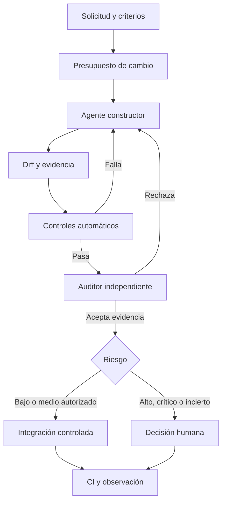

# Anexo A — Protocolo operativo para código generado por IA

## A.1 Desconfianza controlada

Todo código producido, completado, refactorizado o corregido por una IA comienza como **propuesta no verificada**. Fluidez, seguridad verbal y apariencia del diff no son evidencia. La IA constructora no puede ser autoridad final sobre su propio cambio.

## A.2 Separación de funciones

### Constructor

Puede analizar el objetivo autorizado, proponer presupuesto, modificar el alcance aprobado, escribir pruebas, ejecutar verificaciones preliminares y declarar riesgos. No puede aprobar definitivamente.

### Auditor

Recibe la solicitud original, comienza en solo lectura e inspecciona diff, pruebas, evidencia, seguridad, arquitectura, regresiones, deuda y omisiones. No debe limitarse a confirmar al constructor.

### Herramientas

Compilador, test runner, analizadores, escáneres y CI producen evidencia mecánica que prevalece sobre narrativas.

### Humano

Interviene obligatoriamente ante riesgo alto/crítico, arquitectura, migraciones, autenticación, autorización, criptografía, contratos públicos, dependencias sensibles, incertidumbre material o excepciones.

## A.3 Cadena mínima

No se saltan etapas salvo excepción escrita, temporal y aprobada.

## A.4 Estados de una entrega

- **PROPUESTO:** existe código, no fue ejecutado.
- **COMPILADO:** build pasó en entorno declarado.
- **PROBADO:** pasaron pruebas identificadas.
- **VERIFICADO:** se cumplieron criterios observables.
- **REPRODUCIBLE:** se repitió desde entorno limpio.
- **PROTEGIDO:** CI y pruebas bloquean la regresión evaluada.
- **APROBADO:** autoridad independiente aceptó riesgo residual.

No usar “listo”, “perfecto” o “todo correcto” sin estado y evidencia.

## A.5 Evidencia obligatoria

Toda entrega debe indicar:

1. objetivo y criterios;
2. commit base y resultado;
3. archivos y resumen de diff;
4. cambios de comportamiento y comportamiento preservado;
5. pruebas creadas, modificadas o eliminadas;
6. comandos y códigos de salida;
7. build, lint, tipos y pruebas;
8. cobertura relevante;
9. seguridad;
10. dependencias y lockfiles;
11. pasos no ejecutados;
12. riesgos, incertidumbres y rollback;
13. decisión del auditor.

`NO APLICA` requiere razón. `NO VERIFICADO` identifica lo no demostrado. No se permiten campos vacíos silenciosos.

## A.6 Presupuesto de cambio

Antes de editar declarar archivos esperados, tamaño aproximado, interfaces, pruebas, dependencias, riesgos, condición de detención y rollback.

Detener y reevaluar al aparecer archivos imprevistos, dependencia nueva, necesidad de arquitectura, crecimiento sustancial, fallos previos no relacionados, reducción de controles o imposibilidad de reproducción.

## A.7 Puertas mínimas

Formato sin autocorrección silenciosa, lint, tipos, build limpio, unitarias, integración, end-to-end crítico, cobertura del código modificado, secretos, dependencias, lockfiles, arquitectura y diff. Para módulos críticos añadir mutation testing, propiedades, fuzzing, rendimiento, concurrencia y recuperación según riesgo.

## A.8 Límites de autonomía

Sin autorización explícita la IA no puede borrar datos, ejecutar migraciones irreversibles, cambiar producción, manejar secretos sensibles, modificar permisos, mover dinero, publicar releases, fusionar ramas protegidas, desactivar controles, aceptar vulnerabilidades críticas, actualizar dependencias masivamente ni reescribir arquitectura.

## A.9 Falsos verdes

Se prohíbe eliminar/comentar pruebas, debilitar aserciones, ignorar pruebas, reintentar indiscriminadamente, inflar timeouts, descartar excepciones, convertir errores en warnings, desactivar análisis, excluir código crítico, fijar datos para simular éxito, aceptar snapshots sin inspección o declarar un fallo preexistente sin línea base.

Toda reducción de controles se clasifica al menos como riesgo alto.

## A.10 Auditoría adversarial

El auditor busca requisitos omitidos, extremos, errores silenciosos, validación insuficiente, permisos excesivos, incompatibilidades, cambios accidentales, pruebas que copian implementación, mocks irreales, código muerto, carreras, corrupción, regresiones de rendimiento, dependencias innecesarias, diferencias local/CI y afirmaciones sin artefactos.

Su objetivo es intentar demostrar cómo puede fallar el cambio.

## A.11 Riesgo y aprobación

Los ejemplos de este anexo son explicativos. La matriz vinculante está en [Anexo C](annex-c-control-matrix.md).

- Bajo: local, reversible, sin datos/permisos/contratos.
- Medio: funcionalidad limitada o integración reversible.
- Alto: autenticación, autorización, persistencia, concurrencia, contratos, migraciones, dependencias críticas o ingresos.
- Crítico: dinero, pérdida de datos, secretos, privilegios, producción o irreversibilidad.

## A.12 Entrega al propietario

Comenzar con:

- decisión;
- commit;
- estado de evidencia;
- riesgo;
- bloqueadores;
- no verificado;
- acción humana concreta.

Después adjuntar paquete técnico.

## A.13 Omisión de revisión línea por línea

Solo se permite simultáneamente cuando el alcance fue autorizado, el diff respetó presupuesto, no hay archivos inesperados, todas las puertas pasan, la evidencia es reproducible, existe auditor independiente, no hay bloqueadores altos/críticos, lo no verificado está explícito, CI protege y existe rollback.

Omitir lectura exhaustiva no elimina control humano: lo desplaza hacia reglas, riesgo, excepciones y decisiones irreversibles.

> Una respuesta convincente no reemplaza ejecución. Una ejecución aislada no reemplaza prueba. Una prueba no reemplaza CI. Ninguna IA aprueba por sí sola el código que produjo.
